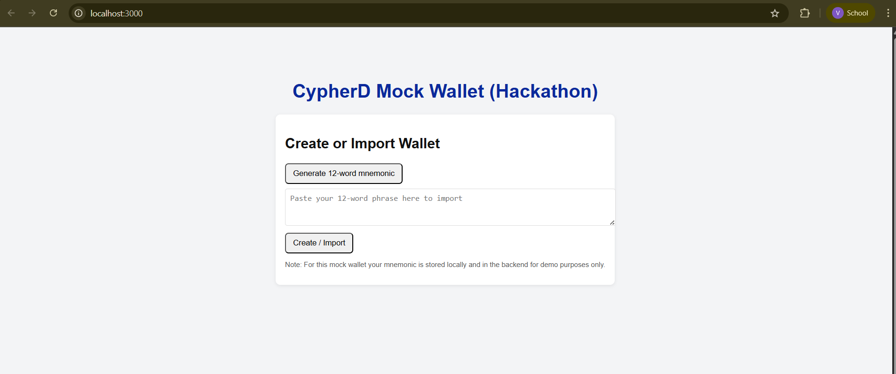
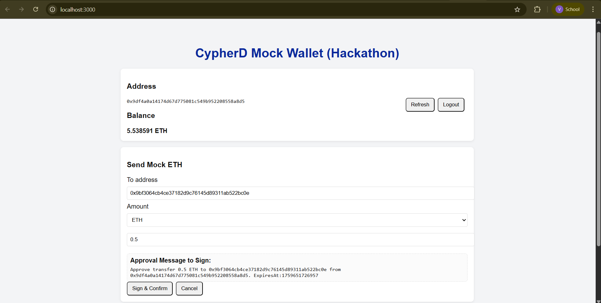

# Mock Web3 Wallet

[](https://nodejs.org/) 
[](https://www.mongodb.com/)
[](https://developer.mozilla.org/en-US/docs/Web/JavaScript)

A simple **Web3 wallet backend** built with **Node.js**, **Express**, **MongoDB**, and **ethers.js**.  
This project allows users to generate Ethereum wallets from mnemonics, store them in MongoDB, and fetch wallet balances.

---

## Features

- Generate a new Ethereum wallet or use an existing mnemonic.  
- Derive wallet addresses using HD derivation (`m/44'/60'/0'/0/0`).  
- Store wallet information (address, mnemonic, balance) in MongoDB.  
- Retrieve wallet balance via API.  
- Random mock balances for demo purposes.  

---

## Tech Stack

- **Node.js & Express.js** – backend server  
- **MongoDB & Mongoose** – database for wallet storage  
- **ethers.js** – Ethereum wallet generation and HD derivation  

---

## Getting Started

### Prerequisites

- Node.js 18.x or above  
- MongoDB Atlas account  

### Clone the repository

```bash
git clone https://github.com/VIVI0007/mock-web3-wallet.git
cd mock-web3-wallet
```
### Example: Create Wallet



### Example: Get Wallet Balance



